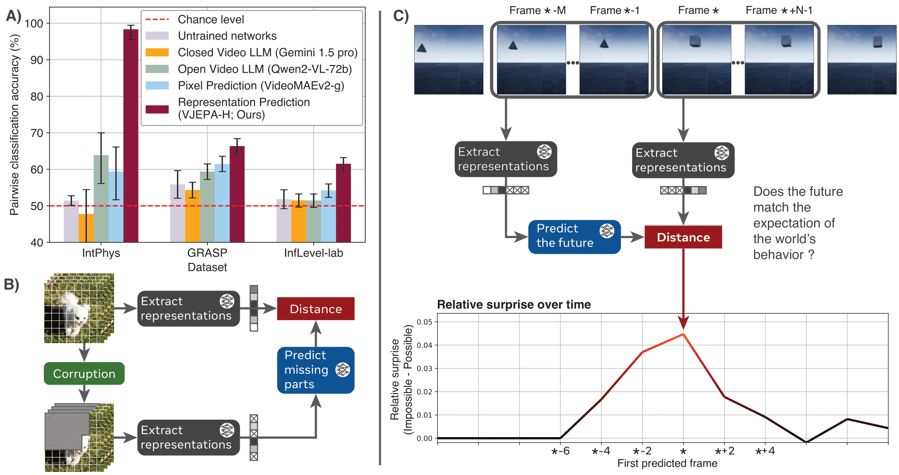

# Intuitive physics understanding emerges from self-supervised pretraining on natural videos


This repository contains the data and code to reproduce the findings of our paper *Intuitive physics understanding emerges from self-supervised pretraining on natural videos*.

We provide evaluation results for all models considered in the paper as well as the evaluation code used to generate them. We also provide a script that can generate every figure from the paper for reproducibility.

Quentin Garrido, Nicolas Ballas, Mahmoud Assran, Adrien Bardes, Laurent Najman, Michael Rabbat, Emmanuel Dupoux, Yann LeCun



## Raw surprises and performance data

After decompressing the data, e.g. by doing `tar -xzvf data_intphys.tar.gz`, you will be left with the following folder structure.
```
data_intphys/
├── model_1/
│   ├── dataset_1/
│   │   ├── performance.csv
│   │   └── raw_surprises/
│   │       ├── property1_XXX.pth
│   │      ...
│   │       └── propertyN_XXX.pth
│   ...
│   └── dataset_M
...
└── model_K/
```

Every model starting with `vit` is a V-JEPA model. Otherwise, the exact model is specified.

For each model and each dataset, we report processed performance in a `performance.csv` file. It can directly be processed by our notebook used to generate figures.

Performance is reported per property and context length, using various metrics (depending on whether the model is a LLM or prediction based model).

We also provide raw_surprises in the `raw_surprises/` folder. The `.pth` files contain all of the raw surprise metrics output by our evaluation code, which are used to determine performance. They are available per model, dataset, and property.

## Figures reproduction

The notebook `figures.ipynb` can be used to reproduce all of the figures in the paper.

After decompressing the data, it can directly be ran and will output all figures computed using the raw performance files.

## Evaluation code

### Running the code

For algorithmic clarity and reproducibility, we provide a version of our code which can be used to extract surprise metrics from models. It is compatible with V-JEPA models and VideoMAEv2. The code is based on [github.com/facebookresearch/jepa](https://github.com/facebookresearch/jepa).

For requirements to run the code, see `requirements.txt` .

We provide two evaluations:
- `intuitive_physics` is the regular evaluation, used for IntPhys, GRASP and InfLevel-lab.
- `intphys_test` is used to run an evaluation on the test set of IntPhys, that can then be submitted on the official leaderboard. It will not give any metrics by itself.

To run the evaluation code, the files `evaluation_code/evals/intuitive_physics/utils.py` and `evaluation_code/evals/intphys_test/utils.py` need to be adapted.

As the code is meant to be reusable on various clusters where data doesn't share a common path. You need to specify what is `CLUSTER` as well as what the paths of the datasets are.
If you intend on only using a singular cluster, the `get_cluster()` function can simply be replaced by:
```python
@lru_cache()
def get_cluster() -> str:
    return CLUSTER
```
Then, just update the dataset paths in `DATASET_PATHS_BY_CLUSTER`.

From the `evaluation_code` folder, evaluations can either be run locally, e.g:
```bash
python -m evals.main --devices cuda:0 cuda:1 cuda:2 cuda:3 cuda:4 cuda:5 --fname evals/intuitive_physics/configs/default_intphys.yaml
```

or through submitit, e.g.:

```bash
python -m evals.main_distributed --fname evals/intuitive_physics/configs/default_intphys.yaml --folder ./logs --partition PARTITION 
```

### Configurations

We provide default configurations in the evaluations folder that should be adapted depending on the model that you are using.

The *pretrain* section contains information to load the pretrained model. Most important are *folder* which is the folder where the checkpoint is located, and *checkpoint* which is the name of the checkpoint.

The parameters *tasks_per_node* and *nodes* are only used when using submitit to control the number of GPUs used. Due to the size of intphys, we recommend using 6 *tasks_per_node* and 1 *node* (as the world size must be a divisor of 30).


## License


All of the code in the present repository is released under CC-BY-NC, which does not allow commercial use. See [LICENSE](LICENSE) for details.
